<h1 align="center">基于SpringBoot框架的机动车号牌管理系统【带论文】</h1>

- <b>完整代码获取地址：从戎源码网 ([https://armycodes.com/](https://armycodes.com/))</b>
- <b>技术探讨、资料分享，请加QQ群：692619798</b>
- <b>作者微信：19941326836  QQ：3645296857</b>
- <b>承接计算机毕业设计、Java毕业设计、Python毕业设计、深度学习、机器学习</b>
- <b>选题+开题报告+任务书+程序定制+安装调试+论文+答辩ppt 一条龙服务</b>
- <b>所有选题地址 ([https://github.com/Descartes007/allProject](https://github.com/Descartes007/allProject)) </b>

## 一、项目介绍

基于SpringBoot框架的机动车号牌管理系统，系统角色为管理员、用户，主要功能如下
### 管理员：
- 基本操作：登录、修改密码、获取个人信息、修改个人信息
- 配置管理：获取配置列表、查看配置详情、新增配置、修改配置、删除配置
- 字典管理：字典目录、车辆类型、新闻类型、号牌类型、号牌申请状态、号牌换补状态、号牌转移状态、性别；筛选字典、查看详情、新增、修改、删除
- 车辆管理：筛选车辆、获取车辆列表、查看车辆详情、新增车辆、修改车辆、删除车辆
- 号牌申请管理：获取申请列表、筛选申请、查看申请详情、审核通过/驳回、修改申请、删除申请
- 号牌转移管理：获取转移列表、筛选转移、查看转移详情、审核通过/驳回、修改转移信息、删除转移信息
- 号牌换补管理：获取换补列表、筛选换补、查看换补详情、审核通过/驳回、修改换补信息、删除换补信息
- 新闻公告管理：发布新闻、获取新闻列表、筛选新闻、查看新闻详情、修改新闻、删除新闻
- 前台用户管理：筛选前台用户、查看用户详情、新增用户、修改用户、重置密码、删除用户
- 管理员账号管理：获取管理员列表、查看详情、新增管理员、修改管理员信息、重置密码、删除管理员
### 用户：
- 基本操作：登录、修改密码、获取个人信息、修改个人信息
- 车辆管理：新增个人车辆、查看车辆详情、修改车辆信息、删除车辆
- 号牌申请：提交申请、查看审核进度、查看申请详情、修改申请、撤回/删除申请
- 号牌转移：提交转移申请、查看审核进度、查看详情、修改/撤回申请
- 号牌换补：提交换补申请、查看审核进度、查看详情、修改/撤回申请
- 新闻公告：查看新闻列表、查看新闻详情
- 个人中心：修改头像、修改个人资料、修改密码

## 二、项目技术

- 编程语言：Java
- 项目架构：B/S
- 前端技术：Vue 2、Element UI、Vuex、Vue Router、Axios
- 后端技术：Spring Boot、MyBatis-Plus、Maven、MySQL

## 三、运行环境

- JDK版本：1.8及以上都可以
- 操作系统：Windows7/10、MacOS
- 开发工具：IDEA、Ecplise、MyEclipse都可以

## 四、数据库配置文件

- npm版本：6.14.13及以上都可以
- Redis版本：3.2.100及以上都可以
- 文件名：application.yml
- 编码类型：utf8

## 论文截图

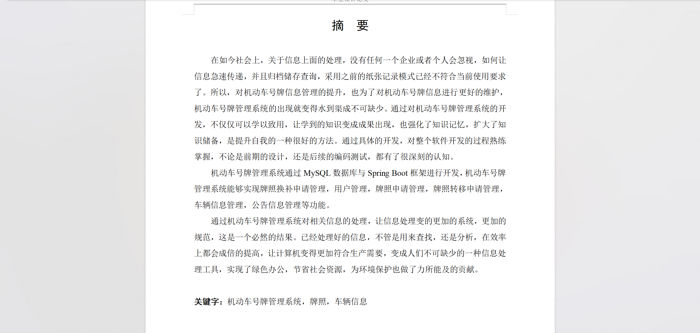

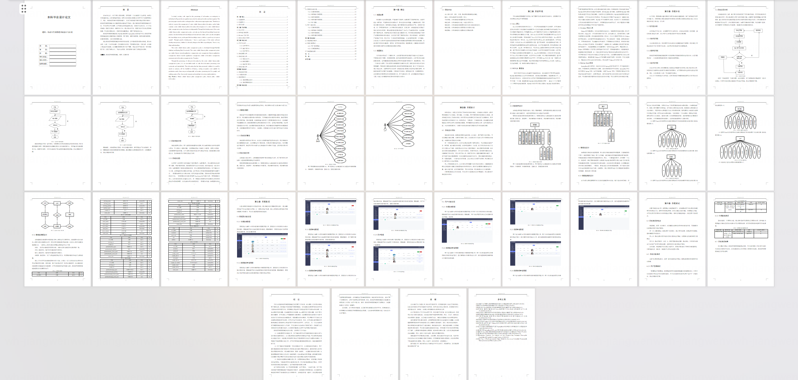

## 系统截图

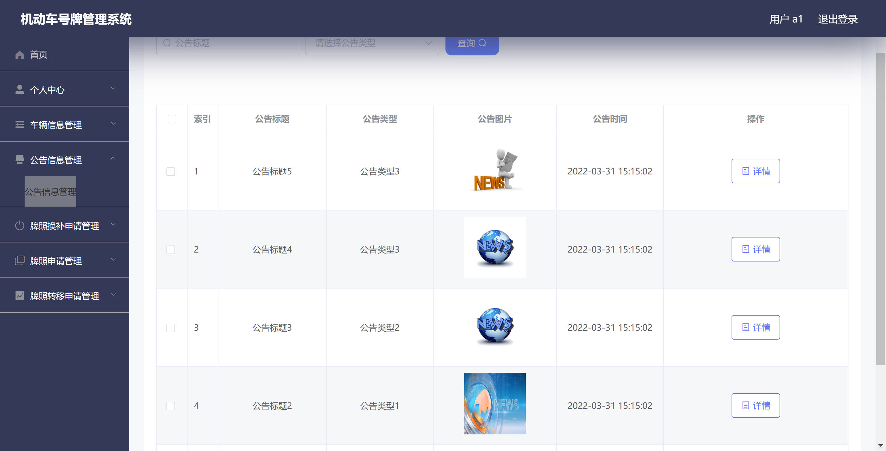

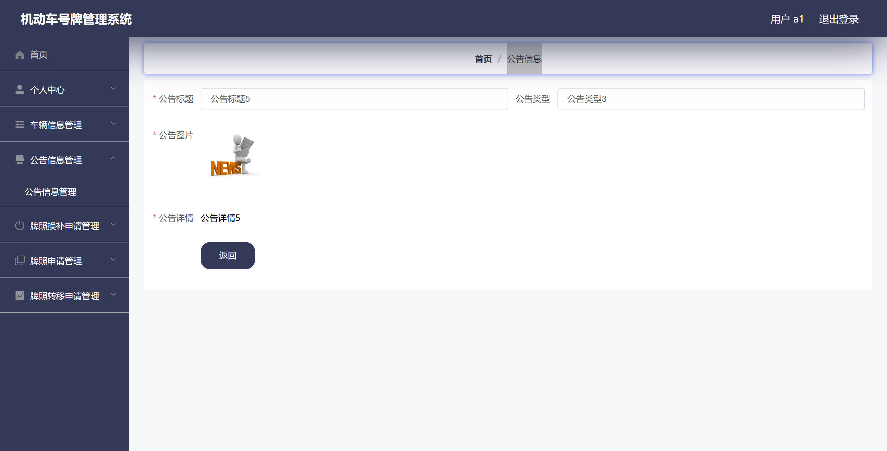

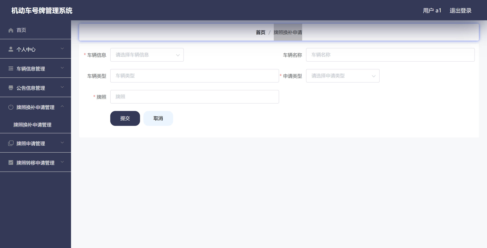

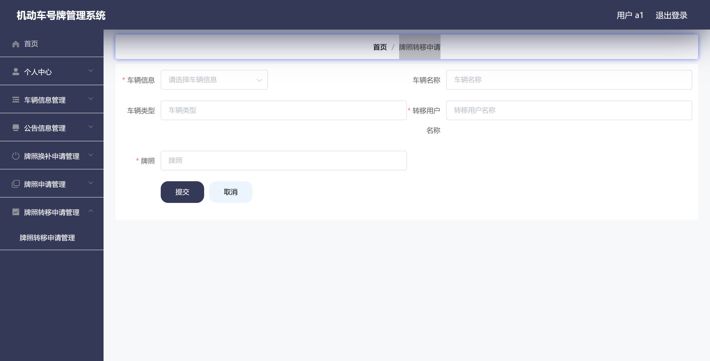

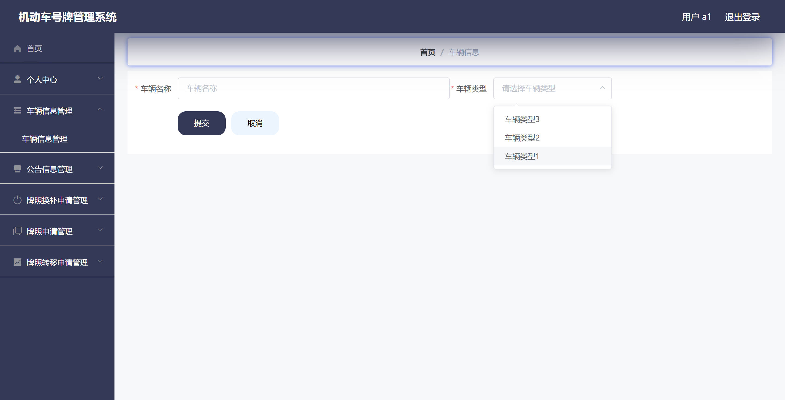

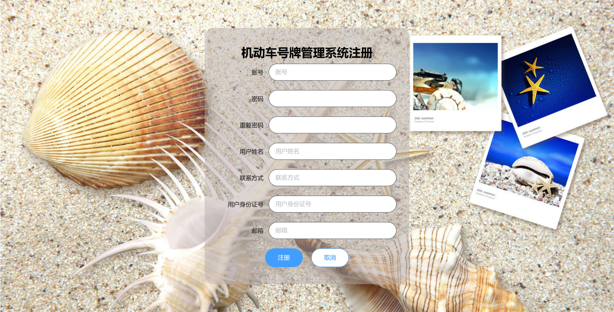

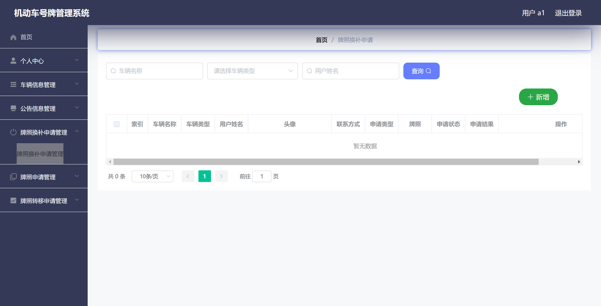

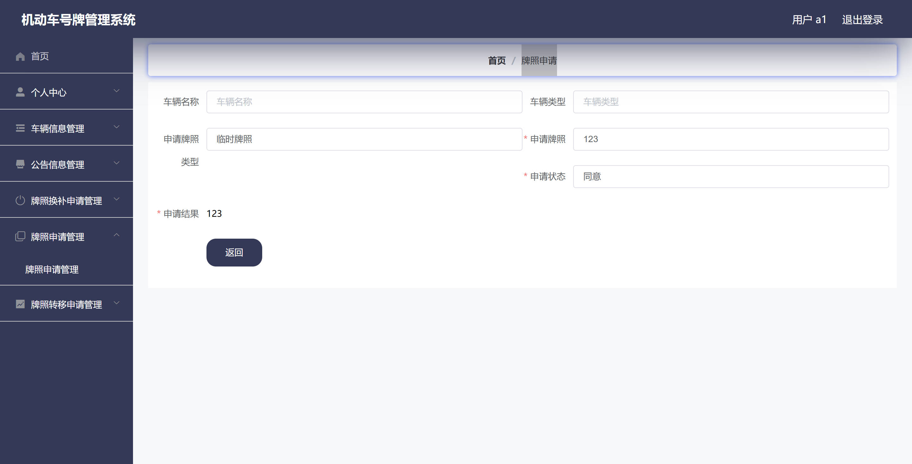

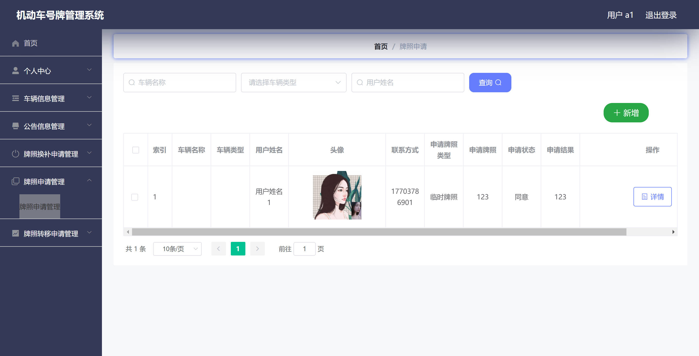

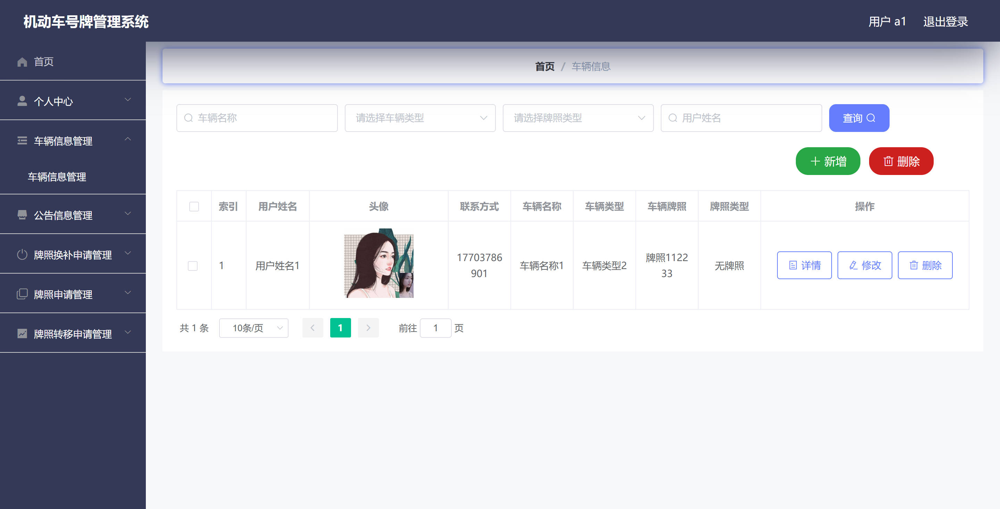
